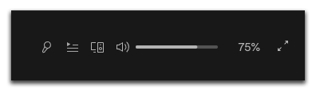

# Spicetify volume percentage
This extension adds the percentage your volume is set at to the right of the volume bar, as seen below. It also has an edit mode, so you can precisely adjust your volume.

 

It also includes settings to totally hide the volume percentage, and to show/hide decimals (2 points) of the percentage.


## Installation
Install from the [marketplace](https://github.com/spicetify/spicetify-marketplace).

Or install manually:

Copy `volumePercentage.js` to the spicetify extenstions folder
| **Platform**    | **Path**                               |
|-----------------|----------------------------------------|
| **MacOs/Linux** | `~/.config/spicetify/Extensions`       |
| **Windows**     | `%userprofile%/.spicetify/Extensions/` |

Run the following commands
```sh
spicetify config extensions volumePercentage.js
spicetify apply
```

## Credits
This repo was originally forked from [jamesrchen/Spicetify-volumePercent](https://github.com/jamesrchen/Spicetify-volumePercent).
